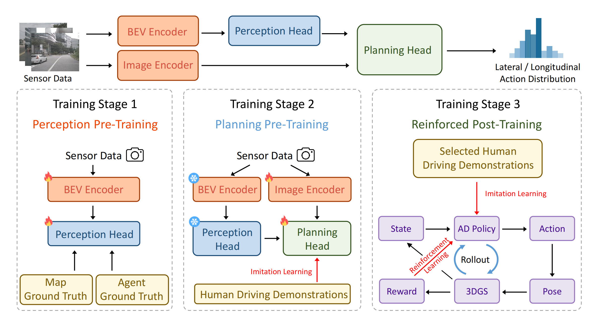

<div align ="center">

<h2>RAD: Training an End-to-End Driving Policy via Large-Scale
  
  3DGS-based Reinforcement Learning</h2>

Hao Gao<sup>1</sup>, [Shaoyu Chen](https://scholar.google.com/citations?user=PIeNN2gAAAAJ&hl=en&oi=sra)<sup>1,2,†</sup>, [Bo Jiang](https://scholar.google.com/citations?user=UlDxGP0AAAAJ&hl=zh-CN)<sup>1</sup>, [Bencheng Liao](https://scholar.google.com/citations?user=rUBdh_sAAAAJ&hl=zh-CN)<sup>1</sup>, [Yiang Shi](https://scholar.google.com/citations?user=AWZwS8AAAAAJ&hl=zh-CN&oi=ao)<sup>1</sup>, [Xiaoyang Guo](https://scholar.google.com/citations?hl=zh-CN&user=CrK4w4UAAAAJ&view_op=list_works&sortby=pubdate)<sup>2</sup>, Yuechuan Pu<sup>2</sup>, Haoran Yin<sup>2</sup>, Xiangyu Li<sup>2</sup>, Xinbang Zhang<sup>2</sup>, Ying Zhang<sup>2</sup>, [Wenyu Liu](http://eic.hust.edu.cn/professor/liuwenyu/)<sup>1</sup>, [Qian Zhang](https://scholar.google.com/citations?user=pCY-bikAAAAJ&hl=zh-CN)<sup>2</sup>,  [Xinggang Wang](https://xwcv.github.io/)<sup>1,📧</sup>

<sup>1</sup> Huazhong University of Science and Technology,
<sup>2</sup> Horizon Robotics,
<sup>†</sup> Project lead
<sup>📧</sup> Corresponding author


[](https://hgao-cv.github.io/RAD/)
[](https://arxiv.org/pdf/2502.13144)
[](LICENSE)


</div>

<div align="center">
  
</div>

## Getting Started
- Project Structure
``` bash
.
├── data/                        # Action anchors for planning/control
├── compute_advantage.py         # Script for computing RL advantages and evaluation metrics
├── generate_action_anchor.py    # Script for generating action anchors for planning/control
├── planning_head.py             # Planning head module
└── README.md
```

- Run Key Scripts
``` bash
# You can quickly test the core functionality by running the provided scripts.
# Generate action anchors
python generate_action_anchor.py

# Run the planning head module
python planning_head.py

# Compute advantage metrics
python compute_advantage.py
```

- Using Your Own Data
> To integrate this project into your pipeline and use your own data, follow these steps:
>
> 1. **Replace the Planning Head**  
>    Use `planning_head.py` to replace the head of your end-to-end algorithm.
>
> 2. **Prepare the Closed-Loop Environment**  
>    Set up your closed-loop environment and collect closed-loop data.
>
> 3. **Compute Advantages and Train the Model**  
>    Use `compute_advantage.py` to calculate advantage values from the collected data, and then use them for model training.

## 📚 Citation
If you find RAD useful in your research or applications, please consider giving us a star &#127775; and citing it by the following BibTeX entry.


```bibtex
@article{RAD,
  title={RAD: Training an End-to-End Driving Policy via Large-Scale 3DGS-based Reinforcement Learning},
  author={Gao, Hao and Chen, Shaoyu and Jiang, Bo and Liao, Bencheng and Shi, Yiang and Guo, Xiaoyang and Pu, Yuechuan and Yin, Haoran and Li, Xiangyu and Zhang, Xinbang and Zhang, Ying and Liu, Wenyu and Zhang, Qian and Wang, Xinggang},
  journal={arXiv preprint arXiv:2502.13144},
  year={2025}
}
```

